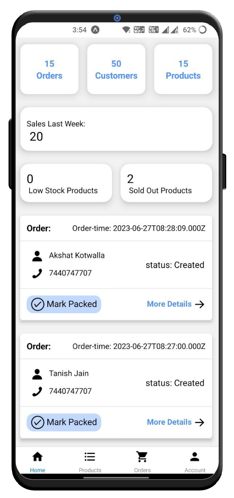
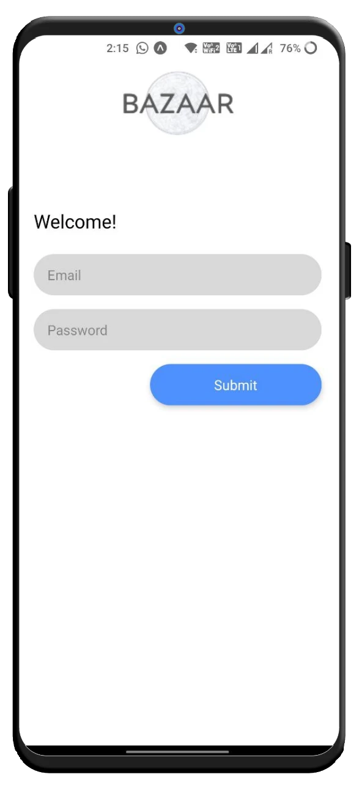

# Open Network for E-Commerce (ONEC) 👜
### A platform for creation and management of ecommerce stores (online) with the seller's own branding.

## Features 🚀
- Unlike a conventional platform where seller works under one brand, there is unique store for each seller.
- Seller can manage sales from Android App.
- End to End integration of seller's dashboard and each store instance in database.

---

## Technologies used 🛠️

- Node.js
- MySQL
- Express.js
- JWT
- React
- React Native
- React Native Paper

---

 
This Project is separated into 3 repos. This repo is the top level repo that houses the frontend module for Admin (Seller) View.
It is built with React Native to provide cross platform support. (Web, Android)
Overall, the project is very similar to shopify's architecture.

The other two repos are:
1. [Bazaar-Backend](https://github.com/DipanshuJ/bazaar-backend): houses the backend for Admin View.
2. [Bazaar- Web](https://github.com/Mit2561/Bazzar-web): consists of both fronted+backend for public view (or customer's view).

---

## A Quick Look at Admin View

  
  
  

---

## Roadmap

- [x] Design Architecture and rules
- [x] Complete end-to-end integration of Seller's View and Customer's View
- [x] Test the Android App for Admin's View
- [ ] Publish the Backend on Cloud
- [ ] Publish the Android App for Admin's View

--- 
### Contributors

